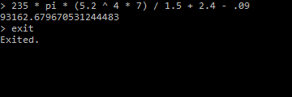

# Calc

**Calc**&nbsp;&mdash; это приложение для вычисления математических выражений в консоли (терминале). Если ввод осуществлен правильно, программа вернет результат выражения на следующей строке. Если ввод произведен не верно, программа выдаст ошибку с объяснением, что было введено не верно. Для выхода из программы введите 'q', 'quit' или 'exit'.



# Технические требования

### Установленное ПО:

- Средства разработки языка Go &geq;v1.18
- Утилита make

# Применение

Для **сборки** приложения **локально**, выполните команду в терминале:

```
make build
```

Для **запуска** приложения **локально**, выполните:

```
make run
```

Чтобы запустить приложение в режиме **быстрого запуска** (например, во время разработки), выполните команду:

```
make fast-run
```

Или выполните ее короткую версию:

```
make
```
